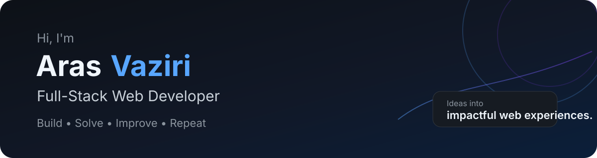

 

## About Me

I'm a full-stack web developer based in Toronto, focused on building practical, scalable web applications with **React, Node.js, Next.js, Express, MongoDB, and modern JavaScript**.

I enjoy turning complex product requirements into clear user experiences, building reliable APIs, and improving existing applications through thoughtful engineering and iteration.

- 🎓 Postgraduate Certificate in Web Development — Humber College, Toronto
- 🎓 Bachelor's Degree in Computer Software Engineering — Azad University, Iran · WES-evaluated for Canadian equivalency
- 💼 Experience across React, WordPress, Node.js, PHP/Laravel, and full-stack web development
- 🧠 Currently deepening my skills in algorithms, AI-assisted products, and production-ready application architecture
- 🚀 Current focus: building **Lighthouse Agent**, an AI-powered growth workflow for Etsy sellers

## What I Bring

<table>
<tr>
<td width="25%" valign="top">

### ⚙️ Modern Web Apps
Responsive, maintainable applications built with modern frontend and backend tools.

</td>
<td width="25%" valign="top">

### 💡 Problem Solving
Breaking down complex requirements into clear, practical technical solutions.

</td>
<td width="25%" valign="top">

### 📈 Product Thinking
Building features around real user needs, measurable outcomes, and iteration.

</td>
<td width="25%" valign="top">

### 🤝 Team Mindset
Clear communication, collaboration, and an eagerness to keep learning.

</td>
</tr>
</table>

## Tech Stack

### Frontend

### Backend & Data

### Tools & Platforms

## Featured Projects

<table>
<tr>
<td width="50%" valign="top">

### 🚀 [CodeLance](https://github.com/abiasV/CodeLance)
Full-stack freelancing platform with employer, freelancer, and admin roles.

**Highlights:** React, Tailwind CSS, TanStack Query, React Hook Form, OTP authentication, role-based authorization, project and proposal workflows.

</td>
<td width="50%" valign="top">

### 📊 [Expense Tracker — GraphQL](https://github.com/abiasV/Expense-graphql)
MERN expense tracker built around a GraphQL architecture.

**Highlights:** Apollo GraphQL, MongoDB, Express, React, Node.js, authentication, mutations, relational GraphQL data, and deployment on Render.

</td>
</tr>
<tr>
<td width="50%" valign="top">

### 📝 [Blog CMS](https://github.com/abiasV/Blog-CMS)
Role-based blog administration system for creating, editing, deleting, and managing content and users.

**Highlights:** PHP, MySQL, authentication, admin/user roles, and CRUD workflows.

</td>
<td width="50%" valign="top">

### 🧪 [Rick and Morty SPA](https://github.com/abiasV/Rick-and-Morty)
React single-page application that consumes the Rick and Morty API.

**Highlights:** React, Vite, async data fetching, API integration, SPA architecture, and responsive UI.

</td>
</tr>
</table>

## Current Focus

I'm currently working on **Lighthouse Agent**, a full-stack AI product designed to help Etsy sellers move from scattered data and uncertainty to prioritized, actionable growth decisions.

The project is helping me deepen my experience with:

- production-oriented AI workflows
- API design and integration
- safe execution and approval flows
- evidence-based decision systems
- deployment and real-user validation

## Let's Connect

I'm open to **frontend**, **React**, **Node.js**, and **full-stack web development** opportunities, as well as conversations about interesting products and technical challenges.

